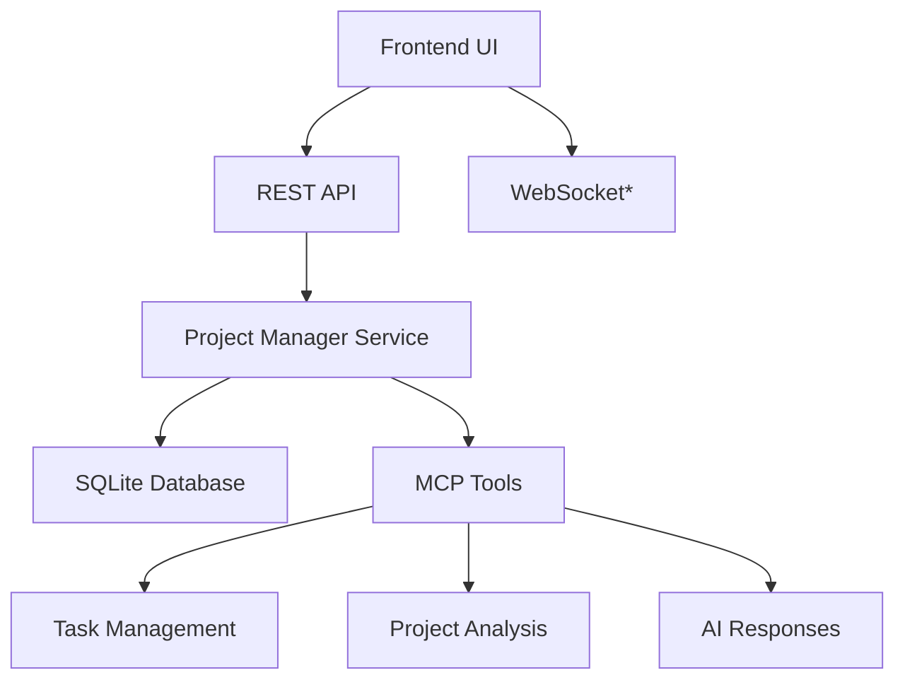

# Project Manager Agent Implementation Plan

## Project Overview

The Project Manager Agent is a comprehensive AI-powered project coordination system for Vibe Kanban that provides intelligent project management, task generation, requirement analysis, and team coordination through a conversational interface backed by MCP (Model Context Protocol) tools.

## Executive Summary

### Completed Features ✅
- **Core Architecture**: Backend API, database schema, and service layer
- **Chat Interface**: Real-time conversational UI with session management
- **MCP Integration**: Full tool ecosystem for project management actions
- **Navigation**: Seamless integration with existing project workflows
- **Agent Intelligence**: Context-aware responses and project analysis

### Current Status
- **Phase 1**: ✅ COMPLETED - Core Implementation & Basic Functionality
- **Phase 2**: 🚧 IN PROGRESS - Testing, Documentation & Polish
- **Phase 3**: 📋 PLANNED - Advanced Features & Integrations

---

## Work Breakdown Structure (WBS)

### Phase 1: Core Implementation ✅ COMPLETED
**Timeline**: Completed  
**Status**: ✅ DONE

#### 1.1 Backend Infrastructure ✅
- [x] Database schema design and migration
- [x] Data models and CRUD operations
- [x] API route implementation
- [x] Service layer with business logic
- [x] Error handling and validation

**Deliverables**:
- `project_manager_sessions` and `project_manager_messages` tables
- REST API endpoints for session and message management
- `ProjectManagerService` with intelligent response generation
- Type-safe database operations with proper error handling

#### 1.2 MCP Tool Integration ✅
- [x] Project Manager Server implementation
- [x] Tool registration and schema definition
- [x] Integration with existing MCP ecosystem
- [x] Type generation for frontend consumption

**Deliverables**:
- `ProjectManagerServer` with 5 core tools
- JSON schema definitions for all tool interfaces
- Integration with existing task and project APIs
- Auto-generated TypeScript types

#### 1.3 Frontend Implementation ✅
- [x] Project Manager page component
- [x] Chat interface with real-time messaging
- [x] Session management and persistence
- [x] Integration with existing UI components
- [x] Navigation and routing updates

**Deliverables**:
- `/projects/:projectId/manager` route
- Real-time chat interface with markdown support
- File search integration with `@` syntax
- Navigation buttons in project detail and task pages

#### 1.4 Agent Intelligence ✅
- [x] Intent recognition and classification
- [x] Context-aware response generation
- [x] Project health analysis
- [x] Task creation from requirements
- [x] Progress tracking and recommendations

**Deliverables**:
- Intelligent response system with multiple intent handlers
- Project context analysis with task status breakdown
- Dynamic recommendation engine
- Requirements-to-tasks conversion capability

---

### Phase 2: Testing, Documentation & Polish 🚧 IN PROGRESS
**Timeline**: Current Sprint  
**Status**: 🚧 ACTIVE

#### 2.1 Comprehensive Testing 📋 PLANNED
- [ ] **Unit Tests**: Backend service layer and API endpoints
- [ ] **Integration Tests**: MCP tool functionality and database operations
- [ ] **E2E Tests**: Complete user workflows with Playwright
- [ ] **Performance Tests**: Load testing for chat and session management
- [ ] **Security Tests**: Input validation and SQL injection prevention

**Testing Strategy**:
```
Backend Testing:
├── Unit Tests (Rust)
│   ├── Service layer logic
│   ├── Database operations
│   ├── API route handlers
│   └── MCP tool implementations
├── Integration Tests
│   ├── Database migrations
│   ├── API endpoint flows
│   ├── MCP server communication
│   └── Cross-service interactions
└── Performance Tests
    ├── Concurrent session handling
    ├── Message throughput
    └── Database query optimization

Frontend Testing:
├── Component Tests (Vitest)
│   ├── Chat interface functionality
│   ├── Session management
│   ├── Message rendering
│   └── Error handling
├── E2E Tests (Playwright)
│   ├── Complete user journeys
│   ├── Navigation flows
│   ├── Real-time messaging
│   └── File search integration
└── Visual Regression Tests
    ├── UI consistency checks
    ├── Responsive design validation
    └── Cross-browser compatibility
```

#### 2.2 Documentation & Screenshots 🚧 IN PROGRESS
- [ ] **Architecture Documentation**: System design and component relationships
- [ ] **API Documentation**: Complete endpoint reference with examples
- [ ] **User Guide**: Step-by-step usage instructions with screenshots
- [ ] **Developer Guide**: Extension and customization instructions
- [ ] **MCP Tool Reference**: Complete tool catalog with use cases

**Documentation Structure**:
```
Documentation/
├── README.md (Updated with new features)
├── ARCHITECTURE.md (System design overview)
├── API_REFERENCE.md (Complete API documentation)
├── USER_GUIDE.md (End-user instructions)
├── DEVELOPER_GUIDE.md (Extension development)
├── MCP_TOOLS.md (Tool reference and examples)
└── Screenshots/
    ├── project-manager-interface.png
    ├── chat-conversation.png
    ├── task-generation-flow.png
    ├── project-health-analysis.png
    └── navigation-integration.png
```

#### 2.3 Playwright Testing & Recording 📋 PLANNED
- [ ] **Full Flow Recording**: Complete user journey from project selection to task creation
- [ ] **Feature Demonstrations**: Individual feature showcases
- [ ] **Error Handling**: Error state and recovery testing
- [ ] **Performance Validation**: Response time and loading state verification

**Test Scenarios**:
1. **New User Onboarding**: First-time project manager access
2. **Task Generation Flow**: Requirements to task creation
3. **Project Health Analysis**: Status review and recommendations
4. **Session Management**: Multiple session handling
5. **Integration Testing**: Cross-component functionality

#### 2.4 Performance Optimization 📋 PLANNED
- [ ] **Database Query Optimization**: Index analysis and query tuning
- [ ] **Frontend Performance**: Bundle size and rendering optimization
- [ ] **Real-time Updates**: WebSocket consideration for live chat
- [ ] **Caching Strategy**: Session and message caching implementation

---

### Phase 3: Advanced Features & Integrations 📋 PLANNED
**Timeline**: Future Sprint  
**Status**: 📋 BACKLOG

#### 3.1 Enhanced AI Capabilities
- [ ] **LLM Integration**: Connect to actual AI services (Claude, GPT, etc.)
- [ ] **Advanced Intent Recognition**: ML-based intent classification
- [ ] **Contextual Memory**: Long-term conversation memory
- [ ] **Personalization**: User-specific preferences and behavior learning

#### 3.2 Advanced MCP Tools
- [ ] **Bulk Task Operations**: Multi-task creation and management
- [ ] **Project Templates**: Reusable project structures
- [ ] **Dependency Management**: Task dependency analysis and visualization
- [ ] **Resource Allocation**: Team member and executor assignment optimization

#### 3.3 Integration Expansions
- [ ] **External APIs**: GitHub, Jira, Slack integration
- [ ] **Notification System**: Real-time alerts and updates
- [ ] **Analytics Dashboard**: Project metrics and insights
- [ ] **Export Capabilities**: Project reports and documentation generation

#### 3.4 Advanced UI Features
- [ ] **Rich Media Support**: File attachments and image embedding
- [ ] **Collaborative Features**: Multi-user sessions and real-time collaboration
- [ ] **Customizable Interface**: Themes and layout preferences
- [ ] **Mobile Optimization**: Responsive design enhancements

---

## Technical Architecture

### System Overview


### Database Schema
```sql
-- Core Tables
project_manager_sessions (
    id BLOB PRIMARY KEY,
    project_id BLOB NOT NULL,
    title TEXT NOT NULL,
    created_at TEXT,
    updated_at TEXT,
    FOREIGN KEY (project_id) REFERENCES projects(id)
);

project_manager_messages (
    id BLOB PRIMARY KEY,
    session_id BLOB NOT NULL,
    role TEXT CHECK (role IN ('user', 'assistant', 'system')),
    content TEXT NOT NULL,
    metadata TEXT, -- JSON for tool calls, file refs
    created_at TEXT,
    FOREIGN KEY (session_id) REFERENCES project_manager_sessions(id)
);
```

### API Endpoints
```
Project Manager API:
├── GET    /api/projects/:id/manager/sessions
├── POST   /api/projects/:id/manager/sessions
├── GET    /api/projects/:id/manager/sessions/:sessionId
├── DELETE /api/projects/:id/manager/sessions/:sessionId
└── POST   /api/projects/:id/manager/sessions/:sessionId/messages
```

### MCP Tools
```
Available Tools:
├── create_project_manager_session
├── send_manager_message
├── create_tasks_from_requirements
├── analyze_project_health
└── suggest_next_actions
```

---

## Quality Assurance

### Testing Coverage Goals
- **Backend**: 90%+ code coverage
- **Frontend**: 85%+ component coverage
- **E2E**: 100% critical path coverage
- **Performance**: <200ms API response time
- **Security**: Zero critical vulnerabilities

### Code Quality Standards
- **TypeScript**: Strict mode with full type safety
- **Rust**: Clippy compliance with zero warnings
- **Documentation**: 100% public API documentation
- **Error Handling**: Comprehensive error scenarios
- **Accessibility**: WCAG 2.1 AA compliance

### Browser Support
- **Chrome**: Latest 2 versions
- **Firefox**: Latest 2 versions
- **Safari**: Latest 2 versions
- **Edge**: Latest version

---

## Risk Assessment & Mitigation

### Technical Risks
1. **Database Performance**: Large conversation histories
   - *Mitigation*: Pagination, archiving, and indexing strategies
2. **Real-time Scalability**: Multiple concurrent sessions
   - *Mitigation*: Connection pooling and caching
3. **AI Response Quality**: Inconsistent or irrelevant responses
   - *Mitigation*: Extensive testing and fallback mechanisms

### User Experience Risks
1. **Learning Curve**: New interface complexity
   - *Mitigation*: Comprehensive onboarding and help system
2. **Integration Confusion**: Multiple ways to create tasks
   - *Mitigation*: Clear UI distinctions and user guidance

---

## Success Metrics

### Functional Metrics
- ✅ **Core Functionality**: All planned features implemented
- ✅ **API Coverage**: Complete CRUD operations
- ✅ **Integration**: Seamless navigation and workflow
- 🚧 **Performance**: <200ms response times
- 📋 **Reliability**: 99.9% uptime

### User Experience Metrics
- 📋 **Adoption Rate**: % of users trying project manager
- 📋 **Task Generation**: Tasks created via agent vs manual
- 📋 **Session Duration**: Average conversation length
- 📋 **User Satisfaction**: Feedback scores and usage patterns

---

## Next Steps

### Immediate Actions (Phase 2)
1. **Complete Type Generation**: Resolve cargo build issues
2. **Comprehensive Testing**: Unit, integration, and E2E tests
3. **Playwright Documentation**: Record complete user flows
4. **Performance Optimization**: Database and frontend tuning

### Sprint Planning
- **Week 1**: Testing infrastructure and unit tests
- **Week 2**: E2E testing and Playwright recordings
- **Week 3**: Documentation and screenshot generation
- **Week 4**: Performance optimization and polish

---

## Conclusion

The Project Manager Agent represents a significant advancement in Vibe Kanban's project management capabilities. With the core implementation complete, the focus shifts to thorough testing, documentation, and performance optimization to ensure a production-ready feature that enhances user productivity and project coordination.

The modular architecture and comprehensive MCP tool integration provide a solid foundation for future enhancements and AI capability expansions, positioning Vibe Kanban as a leader in AI-powered project management tools.

---

*Last Updated: 2025-07-16*  
*Phase: 2 - Testing & Documentation*  
*Status: 🚧 Active Development*